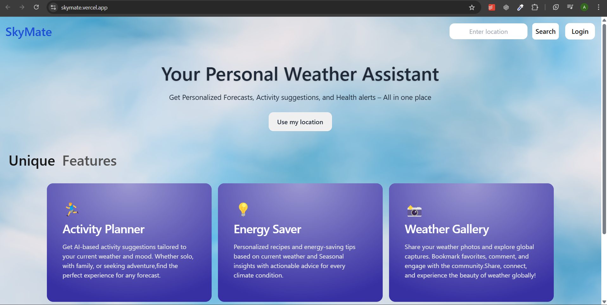
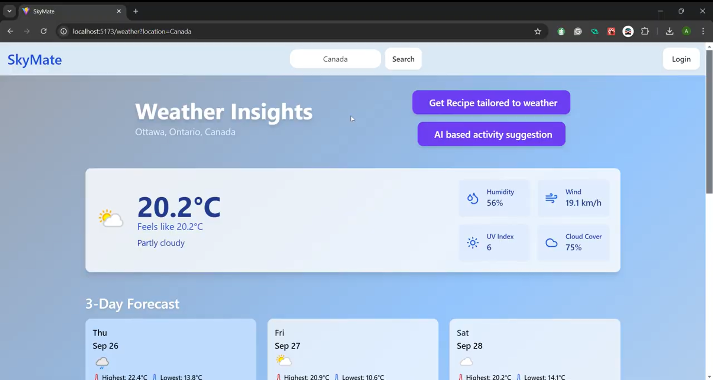
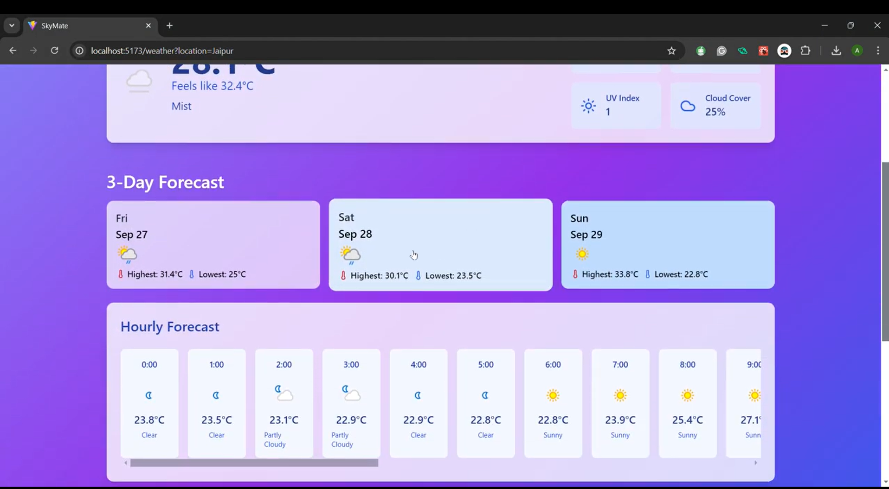
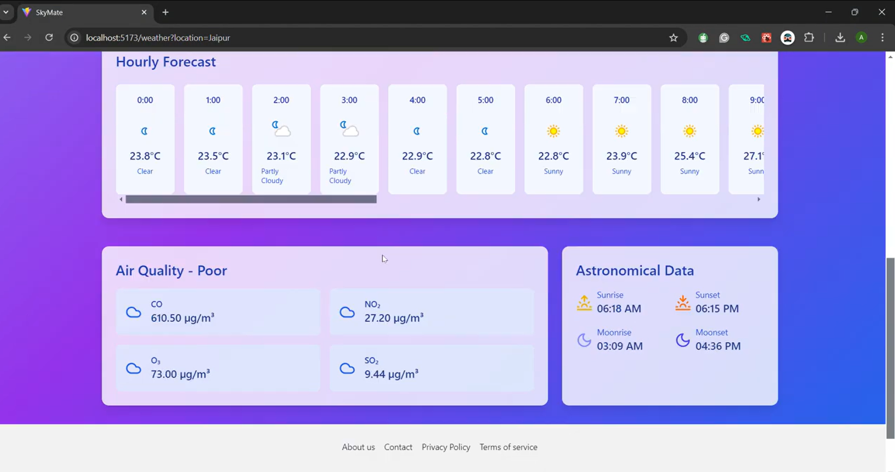

# SkyMate: Smart Weather & Community Platform

A personalized weather application that goes beyond basic forecasts to provide lifestyle recommendations, energy-saving tips, and a community platform for weather-related discussions.

## 🎥 Demo Video (click to play)

[](https://drive.google.com/file/d/1xr3n5NggrCCXnj8NGZDdhhqiCYlXkeX0/view)

## 🌟 Features

### Weather Information 🌦️
- 3-day detailed weather forecasts 📅
- Real-time air quality monitoring 🌫️
- Weather-based activity recommendations 🏃‍♂️
- Customized energy conservation tips ⚡
- Weather-appropriate recipe suggestions 🍲
  
### Community Platform 🤝
- User authentication & authorization 🔑
- Create and share weather-related posts 📝
- Bookmark favorite posts 📚
- Interact with community content 💬
- Personalized user profiles 👤

  ---

## Screenshots

### Real-time weather forecasting
  

  

  


## Technologies

- **Frontend:**
  - React.js
  - Context API for state management
  - Responsive design for all devices

- **Backend:**
  - Node.js
  - Express.js
  - MongoDB with Mongoose

- **Authentication & Security:**
  - OAuth 2.0
  - Bcrypt for password hashing
  - JWT for secure sessions

- **APIs:**
  - RESTful API architecture
  - Weather API for weather forecast
  - GROQ API for recipes suggestions
  - GEMINI API for activity suggestions
  - Cloudinary for optimized image uploads

## 📋 Prerequisites

```bash
Node.js >= 14.x
MongoDB >= 4.x
npm >= 6.x
```

## 🚀 Installation

1. Clone the repository
```bash
git clone https://github.com/Anamika1608/SkyMate.git
cd SkyMate
```

2. Install dependencies for both frontend and backend
```bash
# Install backend dependencies
cd server
npm install

# Install frontend dependencies
cd ../client
npm install
```

3. Set up environment variables
```bash
# In server directory, create .env file
MONGODB_URL=your_mongodb_url
JWT_SECRET=your_jwt_secret
OAUTH_CLIENT_ID=your_oauth_client_id
OAUTH_CLIENT_SECRET=your_oauth_client_secret
WEATHER_API_KEY=your_weather_api_key
CLOUDINARY_API_KEY=your_cloudinary_api_key
CLOUDINARY_API_SECRET=your_cloudinary_secret

# In client directory, create .env file
VITE_GEMINI_API_KEY=your_api_key
VITE_GROQ_API_KEY=your_api_key
```

4. Start the application
```bash
# Start backend server (from server directory)
npm run server

# Start frontend (from client directory)
npm run dev
```


